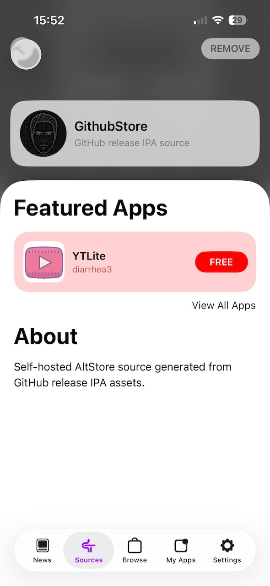
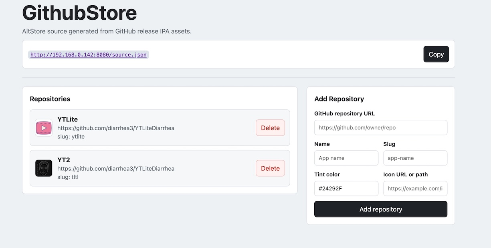

# GithubStore


Self-hosted AltStore / SideStore / LiveContainer source generated from GitHub repositories.

GithubStore reads each configured repository's latest GitHub release and adds the first suitable `.ipa` release asset to one combined source.

> [!NOTE]
> If you are looking to have an IPA repository from Telegram channels, check out [TeleStore](https://github.com/yazdipour/TeleStore).

## Screenshot of the generated source in SideStore:



## Quick Setup

1. Create `docker-compose.yml`:

```yaml
services:
  app:
    image: ghcr.io/yazdipour/githubstore:latest
    ports:
      - "8080:8080" # if port 8080 is already in use, change the left side to an available port, e.g. "8081:8080" and do not forget to update the base_url in config.yml accordingly.
    volumes:
      - ./config.yml:/app/config.yml
    restart: unless-stopped
```

2. Create `config.yml` (or copy from `config.example.yml`) and configure:

```yaml
server:
  base_url: http://localhost:8080 # Set reachable URL if accessing from another device
  ui_config: false # Set true to enable web UI for managing repositories

github:
  token: "" # Optional. Increases API rate limits from 60 to 5000 req/hr

source:
  name: GithubStore
  slug: source
  subtitle: GitHub release IPA source
  description: Self-hosted AltStore source generated from GitHub release IPA assets.
  tint_color: "#24292F"
  cache_seconds: 600

repositories: []
```

4. Add repository:

Adding through UI:

By setting `server.ui_config: true` in `config.yml`, you can access the web UI at `http://localhost:8080/` to add and delete repositories.

> [!CAUTION]
> The UI is very basic and does not have any authentication, so only enable it in a secure environment.
> 
> We recommend after adding repositories via the UI, to disable it again by setting `ui_config: false` and restarting the server.



Or add repository entries under `repositories` inside `config.yml`. GithubStore uses each GitHub repo name for the app name and slug by default:

```yaml
repositories:
  - url: https://github.com/example/example-ios-app
    tint_color: "#24292F"
    icon: imgs/ShaFace-small.png
```

4. Start the server: `docker compose up -d`

5. Add the source URL in AltStore, SideStore, or LiveContainer: `http://localhost:8080/source.json`

*Note: Replace `localhost` with your computer's IP if adding from a phone (e.g., `http://192.168.1.50:8080/source.json`).*

## How IPA Files Work

Each repository contributes one app entry for each `.ipa` asset on the latest GitHub release. If a release contains multiple `.ipa` files, GithubStore includes all of them, sorting normal-looking files before debug or symbol-looking files and larger files first within each group.

If a repository has no latest release or no `.ipa` asset on that release, the source includes an error entry for that repository.

## Developer Setup

Use the local build when changing source:

```bash
cp config.example.yml config.yml
docker compose -f docker-compose.local.yml up --build
```

The generated source is also available at `/source.json`; if you change `source.slug`, it is additionally available at `/{source.slug}.json`.

## AI Acknowledgment

This project was built with the assistance of AI tools for code generation and refactoring.

## License

MIT License. See [LICENSE](./LICENSE) for details.
